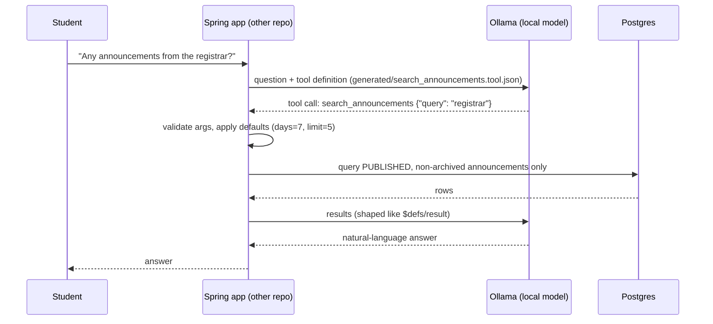

# How archways-assistant works

This repo is the **Python side** of a local AI assistant for UST Archways. It does not answer questions or search a database itself. Its job is to define, test and probe **one tool**, `search_announcements`, that a small language model (running locally in Ollama) can call. The Java/Spring app (separate repo) is what actually runs the search against Postgres.

## The big picture



The model never touches the database and never "knows" announcements from training. It only asks for them through the tool, at question time.

## Folder map

| Path | What it is |
|---|---|
| `contracts/search_announcements.schema.json` | **The source of truth.** A JSON Schema describing the tool's arguments and its results. |
| `src/archways_assistant/tooldef.py` | Generator that turns the contract into the tool definition Ollama understands. |
| `generated/search_announcements.tool.json` | Output of the generator. Never edit by hand. |
| `scripts/probe_tool_call.py` | Sends test questions to a local Ollama model and checks whether it calls the tool correctly. |
| `prompts/system_v1.txt` | The system prompt the probe sends, with a `{today}` placeholder. New versions are new files. |
| `evals/dev_questions.jsonl` | The 30 development questions the probe asks by default, one JSON object per line. |
| `tests/test_search_announcements_schema.py` | Tests that the contract accepts good data and rejects bad data. |
| `tests/test_tooldef.py` | Tests that the generated file is up to date and correct. |
| `src/archways_assistant/__init__.py` | Placeholder `main()` from `uv init`; prints a hello message. Not used yet. |
| `docs/devlog.md` | Dated development history, newest first. |
| `CLAUDE.md` | Project rules (no secrets, no real DB, defaults live in Spring, etc.). |
| `pyproject.toml`, `uv.lock`, `.python-version` | Python 3.12 project managed by uv. Runtime has no dependencies; dev tools are `pytest`, `ruff`, `jsonschema`, `rfc3339-validator`, `httpx`. |

## 1. The contract (`contracts/search_announcements.schema.json`)

A JSON Schema (draft 2020-12) with ID `urn:archways:tool:search-announcements:v1`. The `v1` matters: a breaking change gets a new `v2` instead of editing v1, so both apps can tell which version they speak.

It has three parts under `$defs`:

### `arguments`: what the model sends

| Field | Type | Rules | Default |
|---|---|---|---|
| `query` | string | **required**, 1–200 chars, must contain a non-space character | — |
| `days` | integer | 1–30, how far back to look by publish date | 7 |
| `limit` | integer | 1–10, max results | 5 |

`additionalProperties: false` means the model can't invent extra fields. The defaults are only **documented** here; the Spring app is responsible for applying them.

### `announcement`: one search result

`id`, `title` (≤255), `excerpt` (≤500, Spring truncates the body), `office`, `priority`, `year_level` and `posted_at`. All are required.

- `year_level`: an integer (1 = first year, …) or `null`, which means *all students*.
- `posted_at`: a date-time that **must include a UTC offset** like `+08:00`. The DB column has no time zone, so Spring attaches one.

### `result`: what Spring sends back

An array of announcements, newest first, at most 10 items. That 10 must match `arguments.limit.maximum`.

### Two kinds of text in the schema

- `description` is **written for the model**. It ends up in the prompt.
- `$comment` holds **notes for developers** (Spring's responsibilities, design rules). It is never sent to the model.

## 2. The generator (`src/archways_assistant/tooldef.py`)

Ollama expects tools in a simpler "function tool" format, and small models do better with plain-English hints than with JSON Schema keywords. The generator bridges the two.

Run it with:

```bash
uv run python -m archways_assistant.tooldef
```

Step by step:

1. `main()` reads the contract and calls `build_tool_definition(schema)`.
2. `build_tool_definition` takes the schema's `title` as the function name, its `description` as the function description, and `$defs/arguments` as the parameters.
3. For each argument, `build_property` keeps only `type` and `description`.
4. `describe_constraints` turns the constraint keywords into sentences appended to the description:
   - `minimum` + `maximum` → "Whole number from 1 to 30."
   - `minLength: 1` → "Must not be empty."
   - `maxLength` → "At most 200 characters."
   - `pattern: "\S"` → "Must contain at least one non-whitespace character." (looked up in `PATTERNS`)
   - `format` → a sentence from `FORMATS`
   - `default` → "Default 7."
5. `$comment` and `additionalProperties` are dropped silently (`SILENT_KEYWORDS`).
6. **Safety net:** `check_keywords` raises `ValueError` if the schema contains any keyword, pattern or format the generator has no rule for (e.g. `multipleOf`, `$ref`). That way a constraint can never be silently lost from the model's view.
7. `render` writes the JSON with 2-space indent, LF line endings and a trailing newline, so the output is byte-for-byte stable.

Result, for example the `days` property:

```json
"days": {
  "type": "integer",
  "description": "How many days back to look, by publication date. Whole number from 1 to 30. Default 7."
}
```

Paths are found relative to `__file__`, so this works with the editable install `uv sync` sets up but not from a built wheel.

## 3. The probe script (`scripts/probe_tool_call.py`)

An experiment harness: *does a small local model actually use the tool well?* The prompt and the questions live in files, so two runs can be compared just by their inputs.

```bash
uv run python scripts/probe_tool_call.py --model qwen3:1.7b \
    --prompt prompts/system_v1.txt --questions evals/dev_questions.jsonl
```

All three flags are optional; the values above are the defaults. Paths you pass are relative to the current directory.

What it does:

1. Loads the generated tool and the contract's `arguments` schema (for validation).
2. Reads the system prompt from `--prompt` and replaces `{today}` with today's date in Manila time, e.g. `Thursday, 2026-10-08` (fixed `+08:00`; the Philippines has no DST). The file must contain `{today}`. `system_v1.txt` tells the model to call the tool with short keywords, not full sentences, and never to invent announcements.
3. Reads the questions from `--questions` (format below) and stops with the file and line number if a line is invalid or an `id` repeats.
4. Prints one header line that pins down the run:
   ```
   model=qwen3:1.7b prompt=prompts/system_v1.txt questions=evals/dev_questions.jsonl ollama=0.40.1 commit=4073ae0 today=2026-10-08
   ```
   `commit` is the short git hash, with `-dirty` added if the work tree has any uncommitted or untracked changes, because then the hash doesn't fully describe the code or prompt that ran.
5. Sends each question to `http://localhost:11434/api/chat`, one at a time, with `temperature: 0` and `think: false`. For each answer it reports:
   - whether the tool was called, and whether that was the right decision,
   - whether the arguments pass the contract (`jsonschema` validator),
   - whether `query` looks like a sentence (more than 6 words or ends with `?`) instead of keywords,
   - latency, prompt tokens and tokens/second from Ollama's timing fields.
6. Prints a summary: correct decisions, valid arguments and sentence-like queries, then correct decisions per category with the ids of the wrong ones.

Even at `temperature: 0`, two runs of the same inputs can differ slightly (reply wording, argument key order). Compare the decision and validity counts, not exact text.

### Question files

One JSON object per line; blank lines are skipped and extra keys are ignored:

```json
{"id": "dev-001", "question": "May pasok ba bukas?", "expects_tool": true, "category": "class_suspension"}
```

`evals/dev_questions.jsonl` has 30 questions in 11 categories: 18 should trigger the tool (class suspensions, deadlines, offices, year levels, relative dates, typos and slang) and 12 should not (small talk, math and poems, prompt injection, vague messages with no context, and requests for data the model must never see, like drafts or admin notes). Use this file while iterating on prompts.

A **held-out** file, written by hand from real student questions, will be used only for final comparisons. Any file in the same format works with `--questions`. Eval questions must never be copied into a system prompt or training data, or the scores stop meaning anything.

### Prompt versions

Prompts are versioned by file name. To try a change, copy `system_v1.txt` to `system_v2.txt` and edit the copy; never edit an old version. Then every old header line still points at the prompt that actually ran.

It only talks to localhost (`trust_env=False` ignores proxy env vars), never reads `.env` and never touches a database. It doesn't execute the tool; it only inspects what the model *asks for*.

## 4. The tests

Run them with `uv run pytest`.

**`test_search_announcements_schema.py`** treats the contract like code:
- The schema itself is valid draft 2020-12, and its `$id` ends in `:v1`.
- Good arguments and results pass; bad ones fail (empty or whitespace-only query, out-of-range `days`/`limit`, extra fields, missing fields, `posted_at` without an offset, more than 10 results, …).
- It uses a `referencing.Registry` so it can validate against `$defs/...` by `$ref`.

**`test_tooldef.py`** guards the generator:
- `test_generated_file_is_up_to_date`: the committed `generated/` file equals a fresh render. If you change the contract and forget to rerun the generator, this fails.
- No dropped keywords or `$ref` leak into the output, `required == ["query"]`, property names and order match the schema, and every property has a description.
- Golden strings pin the exact descriptions the model sees.
- Changing a schema value changes the sentence, and unknown keywords such as `multipleOf` or `$ref` raise `ValueError`.

## How a change flows through the repo

1. Edit `contracts/search_announcements.schema.json`.
2. Run `uv run python -m archways_assistant.tooldef` to regenerate `generated/`.
3. Run `uv run pytest` (schema tests plus the up-to-date check).
4. Optionally run the probe against Ollama to see how the model reacts. Commit first so the header shows a clean hash.
5. Mirror the change in the Spring app (defaults, allowlist, result shape).

## Key rules behind the design (from `CLAUDE.md`)

- **One source of truth:** the contract. The tool definition is generated from it.
- **Security lives in Spring, not the prompt:** only PUBLISHED, non-archived announcements may reach the model, enforced with an allowlist in the SQL query. A prompt can be talked around; a `WHERE` clause can't.
- **Defaults live in Spring:** the schema only documents them.
- **No real data:** never connect to the team DB; use seed data in `data/seed/` (not created yet).
- **No training on announcements:** they're fetched live, so the model can't repeat stale or made-up news.
- **Clean evals:** eval questions never go into prompts or training data, and the held-out file is only for final comparisons.
- **Immutable prompt versions:** a prompt change is a new file in `prompts/`.

## Not built yet

- `data/seed/` and any seed data.
- The held-out question file (to be written by hand from real student questions).
- An actual app entry point (`main()` is still the `uv init` placeholder).
- Eval cases checking how the model *describes* results, e.g. that `year_level: null` means "all students".
- `priority` is a free string; it could become an `enum` once the allowed values are known.
